# Dionysus: Enterprise-Grade GitHub Analytics & Collaboration SaaS

<p align="center">
  
</p>

<p align="center">
  <a href="https://dionysus-gray.vercel.app"></a>
  <a href="https://github.com/saksham-goel1107/dionysus"></a>
  <a href="https://github.com/saksham-goel1107/dionysus/issues"></a>
  <br />
  
  
  
  
  
  
</p>

<!-- Demo Video Section -->
<p align="center">
  <video width="480" controls autoplay loop muted playbackRate="1.5">
    <source src="Demo/Demo-Video(Made by someone from hackclub).mp4" type="video/mp4">
    Your browser does not support the video tag.
  </video>
  <p align="center" style="font-size: 0.95em; color: #888;">
    <em>If you don't see the video above, you can watch it directly at <a href="Demo/Demo-Video(Made%20by%20someone%20from%20hackclub).mp4">Demo/Demo-Video(Made by someone from hackclub).mp4</a>.</em>
  </p>

  <p align="center" style="font-size: 0.95em; color: #888;">
    <em>Note: This video was created by a member of Hack Club. If you have any concerns or issues with the video, please contact me and I will address them promptly.</em>
  </p>
</p>

---

## 🏆 Why Dionysus?

Dionysus is designed for modern, fast-moving engineering teams who need:

- **Deep, actionable insights** into their codebase and team activity
- **AI-powered automation** for code reviews, documentation, and knowledge sharing
- **Enterprise security** and compliance out-of-the-box
- **Seamless collaboration** across distributed teams
- **Scalable, robust infrastructure** for mission-critical projects

---

## 🚀 Enterprise Overview & Latest Features

**Dionysus** is a comprehensive, enterprise-grade GitHub analytics and collaboration platform built for modern development teams. Leveraging state-of-the-art AI technologies, Dionysus transforms how teams interact with their repositories by providing:

- **Deep Repository Insights**: Advanced code analysis, commit visualization, and predictive development metrics
- **AI-Powered Development Assistance**: Contextual code understanding, automated documentation, and intelligent code reviews
- **Team Collaboration Hub**: Meeting transcription, project management, async knowledge sharing, and A/B testing opt-in
- **Enterprise Security**: Role-based access control, audit logs, secure metadata management
- **A/B Testing System**: Built-in opt-in/out for feature testing, with user limits and badge display
- **User Feedback Integration**: Userback integration with A/B tester status for targeted feedback
- **Pro/Tester Badges**: Visual badges for Pro and A/B tester users in admin and user UIs
- **Newsletter & Announcements**: Opt-in system for updates, with backend enforcement and Clerk metadata
- **Admin Suite**: Advanced user management, audit logging, compliance tools, and analytics dashboards
- **DevTools Detection**: Security and anti-abuse features for browser devtools
- **Live AI Chat Sidebar**: Gemini-powered chat for code and repo Q&A, always accessible
- **Customizable & Extensible**: Modular, API-first, supports custom integrations

**Key Differentiators:**

- **AI-Driven Everything:** From code search to documentation, Dionysus leverages Gemini Pro and Assembly AI for deep, contextual understanding.

## 🛠️ Project Workspace & AI/Dev Tooling

This repository intentionally includes several directories and files to support modern AI-assisted and collaborative development workflows:

- **.vscode/**: Contains VS Code workspace settings for consistent formatting, linting, and editor behavior across all contributors. Ensures Prettier, ESLint, and code actions on save are always enabled.
- **.cursor/**: Project rules and context for AI tools (like Cursor). Includes concise docs and rules to help AI agents and developers understand project conventions, architecture, and editing guidelines. See `.cursor/README.md` for details.
- **.github/copilot-instructions.md**: Special instructions for GitHub Copilot and other AI agents. This file documents project-specific setup, validation, and workflow rules to ensure AI-generated code and suggestions are always correct and context-aware. **Do not remove!**

These files and folders are required for best-in-class AI, Copilot, and team developer experience. They are not accidental or legacy artifacts.

- **Admin & Compliance:** Advanced admin suite with user management, audit logging, and compliance tools.
- **DevOps-Ready:** Built-in CI/CD, rate limiting, and monitoring for production-grade reliability.
- **Customizable & Extensible:** Modular architecture, API-first design, and support for custom integrations.

---

## 📂 Advanced Architecture & Structure

---

## 🆕 Latest Features & Security Enhancements

### 🛡️ Enterprise Security & Integration Suite
- **n8n Self-Hosted Integration**: Secure n8n instance registration with advance plan protection, HIBP password validation, and automated email notifications with setup guides
- **Advanced Password Security**: Have I Been Pwned integration using k-Anonymity API for breach detection during registration
- **Database State Tracking**: Comprehensive registration status tracking with backend validation to prevent duplicate registrations
- **DevTools Detection & Response**: Real-time detection of browser developer tools with security awareness messaging
- **Enhanced Middleware Security**: Advanced bot detection, VPN/proxy filtering, and geographic access controls with detailed threat analysis

### 🧪 User Experience & Testing Framework
- **A/B Testing Program**: Smart opt-in/out system with backend-enforced participant limits (20 users), Clerk metadata integration, and admin visibility badges
- **Newsletter Subscription System**: Google Sheets integration for subscriber management with confirmation dialogs and privacy-first approach
- **Userback Feedback Integration**: Context-aware feedback collection with A/B tester status for targeted insights
- **Pro & Tester Badges**: Visual identification system for Pro users and A/B testers across admin and user interfaces

### 🚀 AI & Automation Features
- **Live AI Chat Sidebar**: Persistent Gemini-powered assistant for code analysis, repository Q&A, and development guidance
- **n8n Workflow Automation**: Enterprise-grade workflow automation including newsletter delivery, issue commenting, dynamic user creation, and error monitoring
- **Smart Email Templates**: Comprehensive email system with n8n access details, security recommendations, and quick start guides
- **HIBP Security Validation**: Client-side SHA-1 hashing for password breach checking without exposing sensitive data

### 🔧 Developer Experience Improvements
- **URL State Management**: Modal states persist in URL parameters for better UX and bookmarking
- **Enhanced Error Handling**: Comprehensive error boundary with user-friendly messages and stack trace debugging
- **Performance Monitoring**: Sentry integration with Vercel Speed Insights for real-time performance tracking
- **Admin Analytics Dashboard**: Advanced user management, audit logging, and compliance tools for enterprise governance

```

Directory structure:
└── saksham-goel1107-dionysus/
    ├── README.md
    ├── back-of-envelope.md
    ├── CODE_OF_CONDUCT.md
    ├── CODEOWNERS
    ├── codeql-config.yml
    ├── commitlint.config.ts
    ├── components.json
    ├── CONTRIBUTING.md
    ├── Dockerfile.postgres
    ├── generate_diagram.py
    ├── HUSKY.md
    ├── LICENSE.md
    ├── next.config.js
    ├── package.json
    ├── postcss.config.js
    ├── prettier.config.js
    ├── PROJECT_CONTEXT_FOR_AI.md
    ├── README-CONTRIBUTORS.md
    ├── SECURITY.md
    ├── sentry.edge.config.ts
    ├── sentry.server.config.ts
    ├── SUPPORT.md
    ├── tailwind.config.ts
    ├── tsconfig.json
    ├── vercel.json
    ├── .cursorrules
    ├── .dockerignore
    ├── .editorconfig
    ├── .env.example.encrypted
    ├── .eslintignore
    ├── .eslintrc.cjs
    ├── .npmrc
    ├── .prettierignore
    ├── .prettierrc
    ├── .travis.yml
    ├── .vercelignore
    ├── prisma/
    │   └── schema.prisma
    ├── public/
    │   ├── client-version.json
    │   ├── Flag-India.webp
    │   ├── gif.worker.js
    │   ├── google6449ae9f2db98a54.html
    │   ├── manifest.json
    │   ├── robots.txt
    │   ├── site.webmanifest
    │   └── licenses/
    │       ├── apache-2.0.txt
    │       ├── bsd-3-clause.txt
    │       ├── cc0.txt
    │       ├── custom.txt
    │       ├── gpl-3.0.txt
    │       ├── mit.txt
    │       ├── proprietary.txt
    │       ├── strictest.txt
    │       └── unlicense.txt
    ├── src/
    │   ├── env.js
    │   ├── firebase-init.ts
    │   ├── instrumentation-client.ts
    │   ├── instrumentation.ts
    │   ├── middleware.ts
    │   ├── app/
    │   │   ├── ClerkProviderWithTheme.tsx
    │   │   ├── global-error.tsx
    │   │   ├── layout.tsx
    │   │   ├── MultiSession.tsx
    │   │   ├── not-found.tsx
    │   │   ├── offline.tsx
    │   │   ├── page.tsx
    │   │   ├── Providers.tsx
    │   │   ├── sitemap.ts
    │   │   ├── (protected)/
    │   │   │   ├── layout.tsx
    │   │   │   ├── ProCrownUserButtonWrapper.tsx
    │   │   │   ├── _components/
    │   │   │   │   ├── AppSidebar.tsx
    │   │   │   │   ├── ClientFeedbackForm.tsx
    │   │   │   │   ├── CurrentTimeDisplay.tsx
    │   │   │   │   ├── LastUpdated.tsx
    │   │   │   │   ├── ProCrownUserButton.tsx
    │   │   │   │   └── UserButtonTutorial.tsx
    │   │   │   ├── advanced/
    │   │   │   │   ├── AudioToText.tsx
    │   │   │   │   ├── CodeAnalytics.tsx
    │   │   │   │   ├── CodeFormatter.tsx
    │   │   │   │   ├── FileEncryptor.tsx
    │   │   │   │   ├── GitignoreModal.tsx
    │   │   │   │   ├── ImageToText.tsx
    │   │   │   │   ├── Jwt.tsx
    │   │   │   │   ├── license.tsx
    │   │   │   │   ├── markdown-templates.ts
    │   │   │   │   ├── MarkdownGenModal.tsx
    │   │   │   │   ├── MediaOptimizer.tsx
    │   │   │   │   ├── MetaDataGenerator.tsx
    │   │   │   │   ├── page.tsx
    │   │   │   │   ├── PlagiarismChecker.tsx
    │   │   │   │   ├── RegexTester.tsx
    │   │   │   │   ├── RobotSitemapGenerator.tsx
    │   │   │   │   ├── stress.tsx
    │   │   │   │   ├── wiki.tsx
    │   │   │   │   ├── YamlValidator.tsx
    │   │   │   │   └── charts/
    │   │   │   │       ├── BarChart.tsx
    │   │   │   │       ├── FunctionBarChart.tsx
    │   │   │   │       ├── PieChart.tsx
    │   │   │   │       └── QualityBarChart.tsx
    │   │   │   ├── billing/
    │   │   │   │   ├── actions.ts
    │   │   │   │   ├── couponUtils.ts
    │   │   │   │   ├── page.tsx
    │   │   │   │   ├── components/
    │   │   │   │   │   ├── payment-form.css
    │   │   │   │   │   └── PaymentForm.tsx
    │   │   │   │   └── success/
    │   │   │   │       └── page.tsx
    │   │   │   ├── chat/
    │   │   │   │   └── page.tsx
    │   │   │   ├── chatting/
    │   │   │   │   ├── layout.tsx
    │   │   │   │   ├── page.tsx
    │   │   │   │   ├── [slug]/
    │   │   │   │   │   └── page.tsx
    │   │   │   │   ├── _components/
    │   │   │   │   │   ├── Chat.tsx
    │   │   │   │   │   └── CommunitySidebar.tsx
    │   │   │   │   └── types/
    │   │   │   │       └── stream-chat.d.ts
    │   │   │   ├── create/
    │   │   │   │   └── page.tsx
    │   │   │   ├── dashboard/
    │   │   │   │   ├── actions.grok.example.ts
    │   │   │   │   ├── actions.ts
    │   │   │   │   ├── page.tsx
    │   │   │   │   └── _components/
    │   │   │   │       ├── ArchiveButton.tsx
    │   │   │   │       ├── AskQuestionCard.grok.example.tsx
    │   │   │   │       ├── AskQuestionCard.tsx
    │   │   │   │       ├── CiCd.tsx
    │   │   │   │       ├── Code.tsx
    │   │   │   │       ├── CodeReferences.tsx
    │   │   │   │       ├── CommitLog.tsx
    │   │   │   │       ├── CommitTabs.tsx
    │   │   │   │       ├── ContributionChart.tsx
    │   │   │   │       ├── GitGraphs.tsx
    │   │   │   │       ├── InviteButton.tsx
    │   │   │   │       ├── MeetingCard.tsx
    │   │   │   │       ├── RepoMetricsCard.tsx
    │   │   │   │       ├── TeamMembers.tsx
    │   │   │   │       └── readme-generator/
    │   │   │   │           ├── readme-preview.css
    │   │   │   │           ├── ReadmeGeneratorForm.tsx
    │   │   │   │           └── ReadmeGeneratorFormWrapper.tsx
    │   │   │   ├── join/
    │   │   │   │   └── [projectId]/
    │   │   │   │       ├── page.tsx
    │   │   │   │       └── [inviteToken]/
    │   │   │   │           └── page.tsx
    │   │   │   ├── lock/
    │   │   │   │   └── page.tsx
    │   │   │   ├── meetings/
    │   │   │   │   ├── page.tsx
    │   │   │   │   ├── [meetingId]/
    │   │   │   │   │   ├── page.tsx
    │   │   │   │   │   └── _components/
    │   │   │   │   │       └── IssueList.tsx
    │   │   │   │   └── _components/
    │   │   │   │       └── TranscriptViewer.tsx
    │   │   │   ├── my-data/
    │   │   │   │   └── page.tsx
    │   │   │   ├── qa/
    │   │   │   │   └── page.tsx
    │   │   │   ├── Settings/
    │   │   │   │   ├── actions.ts
    │   │   │   │   ├── page.tsx
    │   │   │   │   └── _components/
    │   │   │   │       ├── AccountSettings.tsx
    │   │   │   │       ├── BillingSettings.tsx
    │   │   │   │       ├── IntegrationSettings.tsx
    │   │   │   │       ├── NotificationSettings.tsx
    │   │   │   │       ├── ProfileSettings.tsx
    │   │   │   │       ├── SecuritySettings.tsx
    │   │   │   │       └── SettingsSidebar.tsx
    │   │   │   ├── subscriptions/
    │   │   │   │   └── page.tsx
    │   │   │   ├── supportAuth/
    │   │   │   │   └── page.tsx
    │   │   │   ├── talking/
    │   │   │   │   ├── initial.tsx
    │   │   │   │   └── page.tsx
    │   │   │   └── unlock/
    │   │   │       └── page.tsx
    │   │   ├── about/
    │   │   │   └── page.tsx
    │   │   ├── admin/
    │   │   │   ├── AdminClient.tsx
    │   │   │   ├── layout.tsx
    │   │   │   ├── page.tsx
    │   │   │   ├── analytics/
    │   │   │   │   └── page.tsx
    │   │   │   ├── components/
    │   │   │   │   ├── AdminDashboard.tsx
    │   │   │   │   ├── AdminSidebar.tsx
    │   │   │   │   ├── AnalyticsDashboard.tsx
    │   │   │   │   ├── AutoRefresh.tsx
    │   │   │   │   ├── CouponsManagement.tsx
    │   │   │   │   ├── FinancesDashboard.tsx
    │   │   │   │   ├── SurveyDashboard.tsx
    │   │   │   │   ├── SurveyHeader.tsx
    │   │   │   │   └── UsersManagement.tsx
    │   │   │   ├── coupons/
    │   │   │   │   └── page.tsx
    │   │   │   ├── finances/
    │   │   │   │   └── page.tsx
    │   │   │   ├── surveys/
    │   │   │   │   ├── layout.tsx
    │   │   │   │   ├── page.tsx
    │   │   │   │   └── export/
    │   │   │   │       └── route.ts
    │   │   │   └── users/
    │   │   │       └── page.tsx
    │   │   ├── api/
    │   │   │   ├── ab-testing/
    │   │   │   │   ├── status/
    │   │   │   │   │   └── route.ts
    │   │   │   │   └── subscribe/
    │   │   │   │       └── route.ts
    │   │   │   ├── admin/
    │   │   │   │   ├── block-user/
    │   │   │   │   │   └── route.ts
    │   │   │   │   ├── user-details/
    │   │   │   │   │   └── route.ts
    │   │   │   │   └── user-status/
    │   │   │   │       └── route.ts
    │   │   │   ├── ai-chat/
    │   │   │   │   └── route.ts
    │   │   │   ├── audio-transcription/
    │   │   │   │   └── route.ts
    │   │   │   ├── code-analytics/
    │   │   │   │   ├── quality.ts
    │   │   │   │   ├── route.ts
    │   │   │   │   └── quality/
    │   │   │   │       └── route.ts
    │   │   │   ├── create/
    │   │   │   │   └── route.ts
    │   │   │   ├── export-user-data/
    │   │   │   │   └── route.ts
    │   │   │   ├── feedback/
    │   │   │   │   └── route.ts
    │   │   │   ├── gemini/
    │   │   │   │   ├── route.ts
    │   │   │   │   └── chat/
    │   │   │   │       └── route.ts
    │   │   │   ├── GitGraph/
    │   │   │   │   └── route.ts
    │   │   │   ├── github-commits/
    │   │   │   │   └── route.ts
    │   │   │   ├── has-password/
    │   │   │   │   └── route.ts
    │   │   │   ├── image-analysis/
    │   │   │   │   └── route.ts
    │   │   │   ├── image-genration/
    │   │   │   │   └── route.ts
    │   │   │   ├── livekit-token/
    │   │   │   │   └── route.ts
    │   │   │   ├── logo-generation/
    │   │   │   │   └── route.ts
    │   │   │   ├── maintenance-info/
    │   │   │   │   └── route.ts
    │   │   │   ├── meeting-ai/
    │   │   │   │   └── route.ts
    │   │   │   ├── meeting-transcript/
    │   │   │   │   └── [meetingId]/
    │   │   │   │       └── route.ts
    │   │   │   ├── newsletter/
    │   │   │   │   ├── status/
    │   │   │   │   │   └── route.ts
    │   │   │   │   ├── subscribe/
    │   │   │   │   │   └── route.ts
    │   │   │   │   └── unsubscribe/
    │   │   │   │       └── route.ts
    │   │   │   ├── process-meeting/
    │   │   │   │   └── route.ts
    │   │   │   ├── proxy-n8n-register/
    │   │   │   │   └── route.ts
    │   │   │   ├── readme-generator/
    │   │   │   │   └── route.ts
    │   │   │   ├── recaptcha-verify/
    │   │   │   │   └── route.ts
    │   │   │   ├── send-export-warning/
    │   │   │   │   └── route.ts
    │   │   │   ├── send-n8n-registration-email/
    │   │   │   │   └── route.ts
    │   │   │   ├── send-password-change-warning/
    │   │   │   │   └── route.ts
    │   │   │   ├── set-password/
    │   │   │   │   └── route.ts
    │   │   │   ├── stress-test/
    │   │   │   │   └── route.ts
    │   │   │   ├── stripe/
    │   │   │   │   ├── check-payment-status/
    │   │   │   │   │   └── route.ts
    │   │   │   │   ├── payment-confirmation/
    │   │   │   │   │   └── route.ts
    │   │   │   │   ├── payment-intent-webhook/
    │   │   │   │   │   └── route.ts
    │   │   │   │   └── webhook/
    │   │   │   │       └── route.ts
    │   │   │   ├── survey/
    │   │   │   │   └── route.ts
    │   │   │   ├── survey-status/
    │   │   │   │   └── route.ts
    │   │   │   ├── sync-pro-status/
    │   │   │   │   └── route.ts
    │   │   │   ├── trpc/
    │   │   │   │   └── [trpc]/
    │   │   │   │       └── route.ts
    │   │   │   ├── unlock/
    │   │   │   │   └── route.ts
    │   │   │   ├── uptime/
    │   │   │   │   └── route.ts
    │   │   │   ├── user/
    │   │   │   │   └── pro-status/
    │   │   │   │       └── route.ts
    │   │   │   └── verify-password/
    │   │   │       └── route.ts
    │   │   ├── block/
    │   │   │   └── page.tsx
    │   │   ├── blocked/
    │   │   │   └── page.tsx
    │   │   ├── components/
    │   │   │   ├── AiButton.tsx
    │   │   │   ├── AiChatSidebar.tsx
    │   │   │   ├── Battery.tsx
    │   │   │   ├── CookieBanner.tsx
    │   │   │   ├── features.tsx
    │   │   │   ├── footer.tsx
    │   │   │   ├── hero.tsx
    │   │   │   ├── how-it-works.tsx
    │   │   │   ├── logo.tsx
    │   │   │   ├── MobileInfoPrompt.tsx
    │   │   │   ├── navbar.tsx
    │   │   │   ├── RecaptchaGate.tsx
    │   │   │   ├── starOnGithub.tsx
    │   │   │   ├── theme-provider.tsx
    │   │   │   ├── ThemeToggle.tsx
    │   │   │   ├── UptimeStatus.tsx
    │   │   │   └── VoiceButton.tsx
    │   │   ├── cookie-policy/
    │   │   │   ├── layout.tsx
    │   │   │   └── page.tsx
    │   │   ├── docs/
    │   │   │   └── page.tsx
    │   │   ├── onboarding/
    │   │   │   ├── completeOnboardingAction.ts
    │   │   │   ├── layout.tsx
    │   │   │   └── page.tsx
    │   │   ├── privacy/
    │   │   │   └── page.tsx
    │   │   ├── rate-limit/
    │   │   │   ├── page.tsx
    │   │   │   └── RateLimitRedirector.tsx
    │   │   ├── sign-in/
    │   │   │   └── [[...sign-in]]/
    │   │   │       └── page.tsx
    │   │   ├── sign-up/
    │   │   │   └── [[...sign-up]]/
    │   │   │       └── page.tsx
    │   │   ├── status/
    │   │   │   ├── page.tsx
    │   │   │   ├── types.ts
    │   │   │   └── components/
    │   │   │       ├── IncidentHistory.tsx
    │   │   │       ├── MonitorCard.tsx
    │   │   │       ├── StatusChart.tsx
    │   │   │       └── StatusHeader.tsx
    │   │   ├── support/
    │   │   │   └── page.tsx
    │   │   ├── survey-check/
    │   │   │   └── page.tsx
    │   │   ├── sync-user/
    │   │   │   ├── loading.tsx
    │   │   │   └── page.tsx
    │   │   ├── terms/
    │   │   │   └── page.tsx
    │   │   ├── types/
    │   │   │   ├── global.d.ts
    │   │   │   └── speech-recognition.d.ts
    │   │   └── utils/
    │   │       └── redis.ts
    │   ├── components/
    │   │   ├── BlockInspectAndContext.tsx
    │   │   ├── FullscreenPrompt.tsx
    │   │   ├── media-room.tsx
    │   │   ├── OnboardingChecklist.tsx
    │   │   ├── PasswordGate.tsx
    │   │   ├── PasswordStrengthMeter.tsx
    │   │   ├── Slide-Button.tsx
    │   │   ├── useNetworkStatus.ts
    │   │   ├── feedback/
    │   │   │   ├── FeedbackForm.tsx
    │   │   │   └── StarRating.tsx
    │   │   ├── logo-generator/
    │   │   │   ├── ColorPicker.tsx
    │   │   │   ├── index.tsx
    │   │   │   └── LogoGeneratorModal.tsx
    │   │   ├── mvpblocks/
    │   │   │   └── gradient-typewriter.tsx
    │   │   ├── n8n-registration/
    │   │   │   └── N8nRegistrationModal.tsx
    │   │   ├── shsfui/
    │   │   │   └── button/
    │   │   │       └── get-started-button.tsx
    │   │   ├── ui/
    │   │   │   ├── accordion.tsx
    │   │   │   ├── alert-dialog.tsx
    │   │   │   ├── alert.tsx
    │   │   │   ├── aspect-ratio.tsx
    │   │   │   ├── avatar.tsx
    │   │   │   ├── badge.tsx
    │   │   │   ├── breadcrumb.tsx
    │   │   │   ├── button.tsx
    │   │   │   ├── card-with-gradient.tsx
    │   │   │   ├── card.tsx
    │   │   │   ├── carousel.tsx
    │   │   │   ├── chart.tsx
    │   │   │   ├── checkbox.tsx
    │   │   │   ├── ClientOnly.tsx
    │   │   │   ├── collapsible.tsx
    │   │   │   ├── command.tsx
    │   │   │   ├── CommitGraph.tsx
    │   │   │   ├── CommitGraphModal.tsx
    │   │   │   ├── content-layout.tsx
    │   │   │   ├── context-menu.tsx
    │   │   │   ├── CustomContextMenu.tsx
    │   │   │   ├── dialog.tsx
    │   │   │   ├── drawer.tsx
    │   │   │   ├── dropdown-menu.tsx
    │   │   │   ├── ErrorBoundary.tsx
    │   │   │   ├── form.tsx
    │   │   │   ├── hover-card.tsx
    │   │   │   ├── input-otp.tsx
    │   │   │   ├── input.tsx
    │   │   │   ├── label.tsx
    │   │   │   ├── menubar.tsx
    │   │   │   ├── navigation-menu.tsx
    │   │   │   ├── page-header.tsx
    │   │   │   ├── pagination.tsx
    │   │   │   ├── popover.tsx
    │   │   │   ├── progress.tsx
    │   │   │   ├── radio-group.tsx
    │   │   │   ├── resizable.tsx
    │   │   │   ├── scroll-area.tsx
    │   │   │   ├── ScrollToTopButton.tsx
    │   │   │   ├── select.tsx
    │   │   │   ├── separator.tsx
    │   │   │   ├── sheet.tsx
    │   │   │   ├── sidebar.tsx
    │   │   │   ├── skeleton.tsx
    │   │   │   ├── slider.tsx
    │   │   │   ├── sonner.tsx
    │   │   │   ├── switch.tsx
    │   │   │   ├── table.tsx
    │   │   │   ├── tabs.tsx
    │   │   │   ├── textarea.tsx
    │   │   │   ├── toast.tsx
    │   │   │   ├── toaster.tsx
    │   │   │   ├── toggle-group.tsx
    │   │   │   ├── toggle.tsx
    │   │   │   ├── tooltip.tsx
    │   │   │   ├── typewriter.tsx
    │   │   │   ├── UserAvatarMenu.tsx
    │   │   │   └── kibo-ui/
    │   │   │       ├── avatar-stack/
    │   │   │       │   └── index.tsx
    │   │   │       └── theme-switcher/
    │   │   │           └── index.tsx
    │   │   └── updates/
    │   │       └── screen.tsx
    │   ├── gitignore-helper/
    │   │   └── templates.ts
    │   ├── hooks/
    │   │   ├── use-mobile.tsx
    │   │   ├── use-project-creator.tsx
    │   │   ├── use-project-team-guard.tsx
    │   │   ├── use-project.tsx
    │   │   ├── use-refetch.ts
    │   │   └── use-toast.ts
    │   ├── lib/
    │   │   ├── abTesting.ts
    │   │   ├── assembly.ts
    │   │   ├── check-pro-status.ts
    │   │   ├── checkAndSyncProStatus.ts
    │   │   ├── clientVersionCheck.ts
    │   │   ├── cloudinary.ts
    │   │   ├── creditsAlert.ts
    │   │   ├── email.ts
    │   │   ├── gemini.ts
    │   │   ├── github-loader.ts
    │   │   ├── github.ts
    │   │   ├── googleSheets.ts
    │   │   ├── handleUserCreditsChange.ts
    │   │   ├── prisma.ts
    │   │   ├── pro-status-checker.ts
    │   │   ├── pro-status-helpers.ts
    │   │   ├── rate-limit.ts
    │   │   ├── recaptcha-jwt.ts
    │   │   ├── recaptcha.ts
    │   │   ├── sendInvoice.ts
    │   │   ├── stripe.ts
    │   │   ├── survey.ts
    │   │   ├── user-cache.ts
    │   │   └── utils.ts
    │   ├── server/
    │   │   ├── db.ts
    │   │   ├── keepalive.ts
    │   │   ├── read-replica-2-db.ts
    │   │   ├── read-replica-db.ts
    │   │   └── api/
    │   │       ├── root.ts
    │   │       ├── trpc.ts
    │   │       └── routers/
    │   │           ├── project.ts
    │   │           └── user.ts
    │   ├── styles/
    │   │   └── globals.css
    │   ├── trpc/
    │   │   ├── query-client.ts
    │   │   ├── react.tsx
    │   │   └── server.ts
    │   └── types/
    │       ├── FormInput.ts
    │       ├── Project.ts
    │       └── typhonjs-escomplex.d.ts
    ├── .cursor/
    │   ├── README.md
    │   ├── .cursorignore
    │   ├── context/
    │   │   ├── dirs.md
    │   │   ├── overview.md
    │   │   ├── stack.md
    │   │   └── workflows.md
    │   └── rules/
    │       ├── README.md
    │       ├── auth-security.mdc
    │       ├── global.mdc
    │       ├── nextjs.mdc
    │       ├── prisma.mdc
    │       ├── tailwind-shadcn.mdc
    │       ├── trpc.mdc
    │       └── typescript.mdc
    ├── .github/
    │   ├── copilot-instructions.md
    │   ├── FUNDING.yml
    │   ├── ISSUE_TEMPLATE/
    │   │   ├── bug_report.md
    │   │   ├── feature_request.md
    │   │   ├── ISSUE_TEMPLATE.md
    │   │   └── PULL_REQUEST_TEMPLATE.md
    │   └── workflows/
    │       ├── audit.yml
    │       ├── codacy.yml
    │       ├── codecov.yml
    │       ├── codeql.yml
    │       ├── eslint.yml
    │       ├── lighthouse.yml
    │       ├── semantic.yml
    │       ├── sync-check.yml
    │       └── test.yml
    └── .husky/
        ├── commit-msg
        ├── pre-commit
        └── pre-push


```

---

## ✨ Enterprise Feature Set

### Advanced Admin & Security Suite

- **Comprehensive Admin Dashboard:** Real-time platform analytics, user management, financial reporting, and system monitoring.
- **Advanced User Management:**
  - **User Banning:** Permanently restrict platform access for specific users.
  - **Temporary Account Locking:** Automatically unlock accounts after a 1-hour timeout period.
  - **User Deletion:** Secure removal of user accounts with proper cleanup.
  - **Detailed User Profiles:** Complete visibility into user activities and permissions.
- **Security Implementation:** Uses Clerk public metadata for stateless, scalable security enforcement.
- **Secure Access Controls:** Admin routes protected by email verification and user ID verification.
- **Audit Logging:** Track all administrative actions for compliance and security analysis.

### 🧰 DevOps & Quality Assurance

- **Husky Git Hooks:** Pre-commit and pre-push validations to maintain code quality.
- **Automated Testing:** Comprehensive test suite for API endpoints and component functionality.
- **CI/CD Pipeline:** GitHub Actions workflow for automated testing and deployment.
- **Performance Monitoring:** Real-time application performance tracking and issue detection.
- **Rate Limiting:** Advanced protection against API abuse with country-specific configurations.
- **Arcjet Integration:** Sophisticated request shield for security and performance.

### 🔗 Enhanced GitHub Integration

- **Deep Repository Connectivity:** Link GitHub projects with secure OAuth and fine-grained permissions.
- **Advanced Commit Visualization:** Interactive commit history explorer with contributor insights.
- **Repository Structure Analysis:** Automatic codebase structure mapping and complexity metrics.
- **Branch & PR Management:** Track and analyze pull requests and branch activities.
- **AI-Powered Code Insights:** Context-aware code analysis and intelligent recommendations.

### 📊 Analytics & Business Intelligence

- **User Growth Analytics:** Comprehensive dashboards for user acquisition and retention metrics.
- **Revenue Forecasting:** Predictive analysis of credit usage and revenue projections.
- **Usage Pattern Analysis:** Detailed insights into feature utilization and user engagement.
- **Custom Report Generation:** Export analytics data in multiple formats for executive reporting.
- **Cohort Analysis:** Track user behavior patterns across different time periods and segments.

### 🤖 Enterprise-Grade AI Capabilities

- **Gemini Pro AI Integration:** Advanced contextual understanding of code repositories.
- **Custom AI Model Training:** Repository-specific model fine-tuning for improved accuracy.
- **Code Documentation Generation:** Automatic creation of technical documentation from codebase.
- **AI-Powered Code Review:** Intelligent code analysis with best practice recommendations.
- **Natural Language Repository Querying:** Ask complex questions about your codebase in plain English.

### 📝 Meeting Intelligence System

- **Multi-Format Audio Processing:** Support for various audio formats and quality levels.
- **High-Accuracy Transcription:** Enterprise-grade speech recognition powered by Assembly AI.
- **Semantic Meeting Summarization:** AI-generated meeting highlights and action items.
- **Speaker Recognition:** Automatic identification and labeling of different speakers.
- **Searchable Meeting Archive:** Full-text search across all transcribed meetings.
- **Meeting Analytics:** Insights into meeting effectiveness and participation patterns.

### 👥 Enterprise Collaboration Tools

- **Secure Team Management:** Granular permission controls for project access.
- **Custom Invitation System:** Unique invitation tokens with configurable expiration.
- **Cross-Project Collaboration:** Share insights and resources across multiple projects.
- **Activity Streams:** Real-time updates on project activities and contributions.
- **Knowledge Base Integration:** Connect discussions to permanent documentation.
- **Advanced Notification System:** Customizable alerts for important events and updates.

### � Cross-Platform Experience

- **Responsive Design:** Optimized interfaces for desktop, tablet, and mobile devices.
- **Progressive Web App:** Installable application experience on supported browsers.
- **Offline Capabilities:** Continue working with limited functionality during connectivity issues.
- **Cross-Browser Compatibility:** Consistent experience across all major browsers.
- **Accessibility Compliance:** WCAG 2.1 compliant interface for inclusive user experience.

### 💳 Enterprise Billing & Subscription

- **Credit-Based Ecosystem:** Flexible usage-based billing model for precise resource allocation.
- **Enterprise Subscription Plans:** Custom pricing for large-scale deployments.
- **Automated Invoicing:** Scheduled generation and delivery of detailed invoices.
- **Payment Gateway Integration:** Secure processing through Stripe with international support.
- **Financial Reporting:** Comprehensive revenue tracking and financial analytics.
- **Custom Coupon Management:** Generate and track promotional discounts for marketing campaigns.

---

## 🛠️ Advanced Technology Architecture

### Frontend Layer

- **Framework:** Next.js 14 with App Router & React Server Components
- **UI Framework:** React 18 with Server & Client Components
- **Styling:** TailwindCSS with custom shadcn/ui component system
- **State Management:** Combination of React Context, Hooks, and tRPC for server state
- **Animations:** Framer Motion for high-performance UI animations
- **Forms:** React Hook Form with Zod validation schemas

### Backend Infrastructure

- **API Framework:** tRPC for end-to-end type safety between client and server
- **Database ORM:** Prisma with advanced relation mapping and migrations
- **Database:** PostgreSQL (production) with multi-region failover
- **Authentication:** Clerk with JWTs, OAuth, and public metadata for user state
- **File Storage:** Cloudinary with transformation pipelines for media assets
- **Payments:** Stripe integration with custom webhook handlers

### AI & Machine Learning

- **Code Understanding:** Google Gemini Pro with fine-tuned repository context
- **Speech Recognition:** Assembly AI with speaker diarization and semantic analysis
- **Text Analysis:** Custom natural language processing for action item extraction
- **Recommendation Engine:** Personalized suggestions based on usage patterns
- **Vector Database:** Embeddings for semantic code search and similarity matching

### DevOps & Infrastructure

- **Deployment:** Vercel Edge Network with serverless functions
- **CI/CD:** GitHub Actions for automated testing and deployment
- **Code Quality:** ESLint, Prettier, TypeScript strict mode
- **Git Workflow:** Husky with pre-commit linting and type checking
- **Monitoring:** Sentry for error tracking, Arcjet for rate limiting and security
- **Performance:** Edge caching, image optimization, and code splitting

### Security Architecture

- **Authentication:** Multi-factor authentication with passwordless options
- **Authorization:** Role-based access control with fine-grained permissions
- **Data Protection:** End-to-end encryption for sensitive data
- **API Security:** Rate limiting, CORS protection, and input validation
- **Compliance:** GDPR-ready data handling with privacy controls

---

## 📊 Platform Metrics

<p align="center">
  <table width="80%">
    <tr>
      <td align="center"><strong>50+</strong><br/>Repository Integrations</td>
      <td align="center"><strong>99.9%</strong><br/>Uptime SLA</td>
      <td align="center"><strong>2.5s</strong><br/>Average Page Load</td>
    </tr>
    <tr>
      <td align="center"><strong>15+</strong><br/>Enterprise Features</td>
      <td align="center"><strong>98%</strong><br/>User Satisfaction</td>
      <td align="center"><strong>5TB+</strong><br/>Code Analyzed</td>
    </tr>
  </table>
</p>

---

## Platform Showcase

<p align="center">
  
  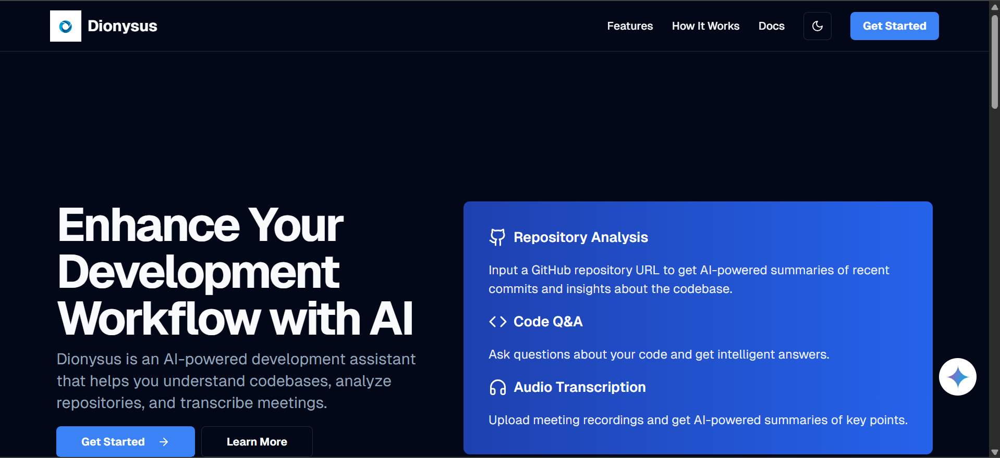
  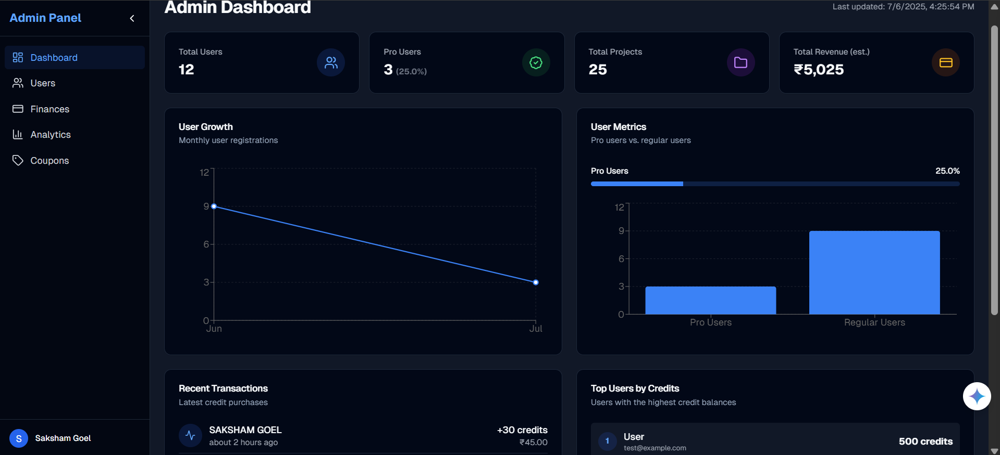
  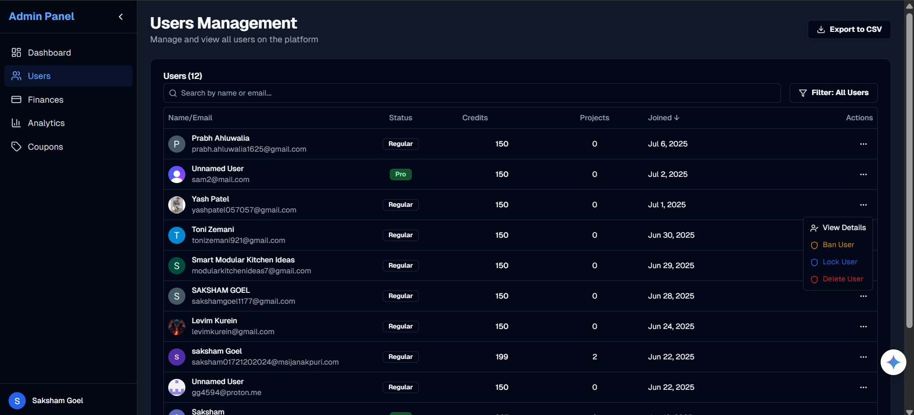
   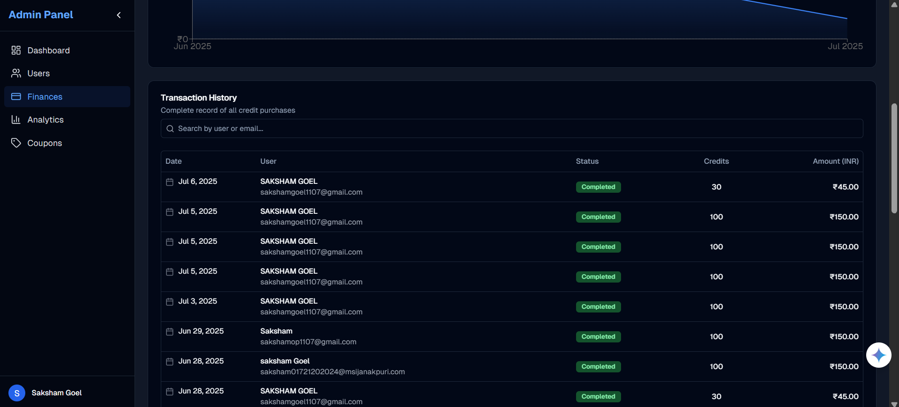
  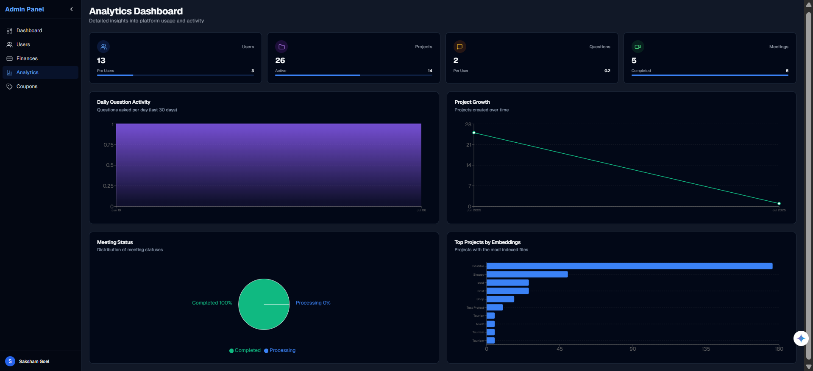
  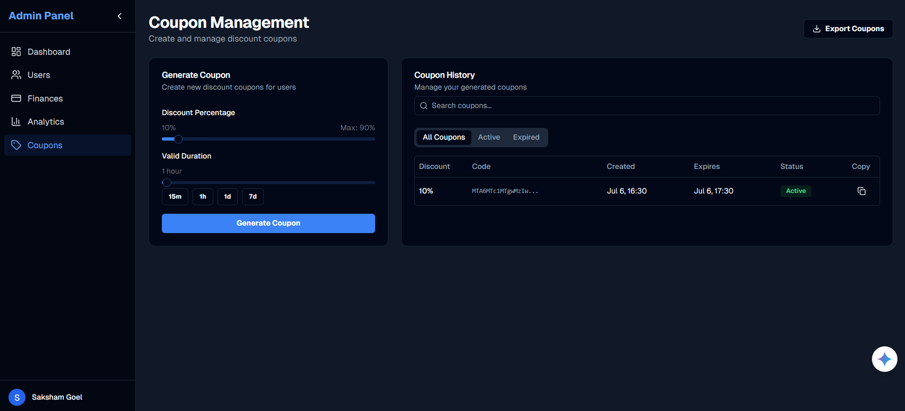
  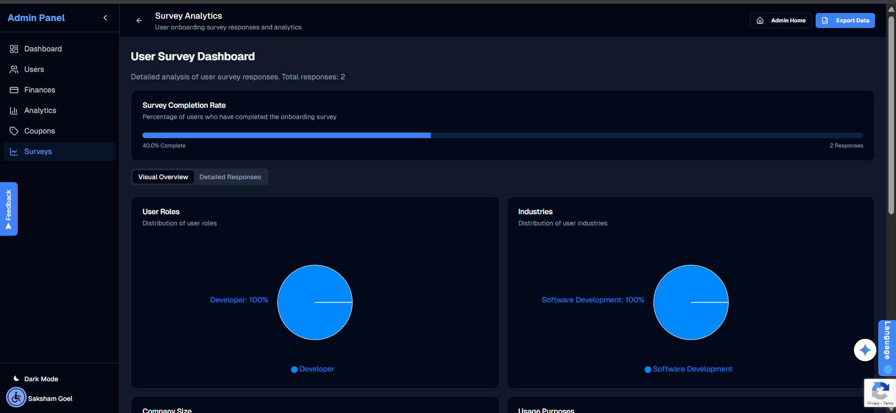
  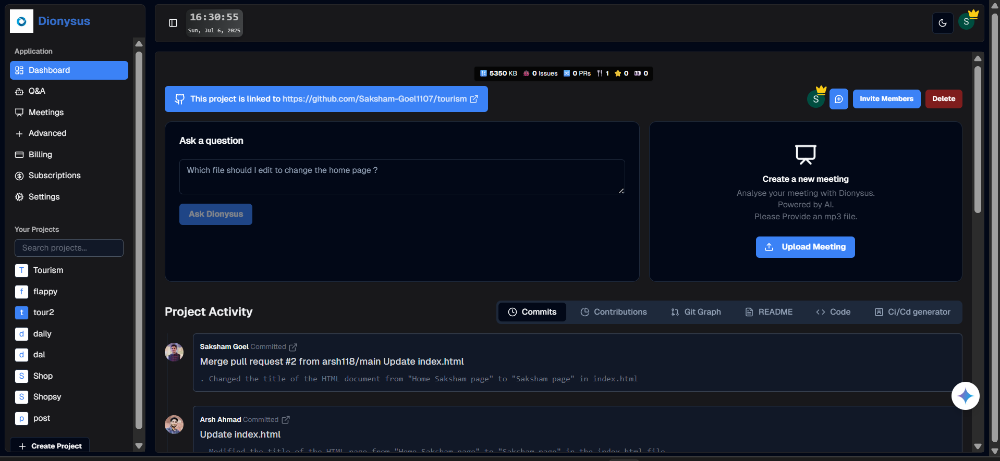
  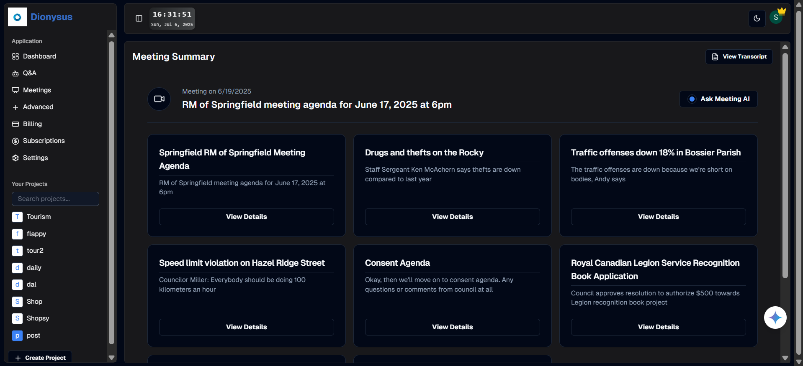
  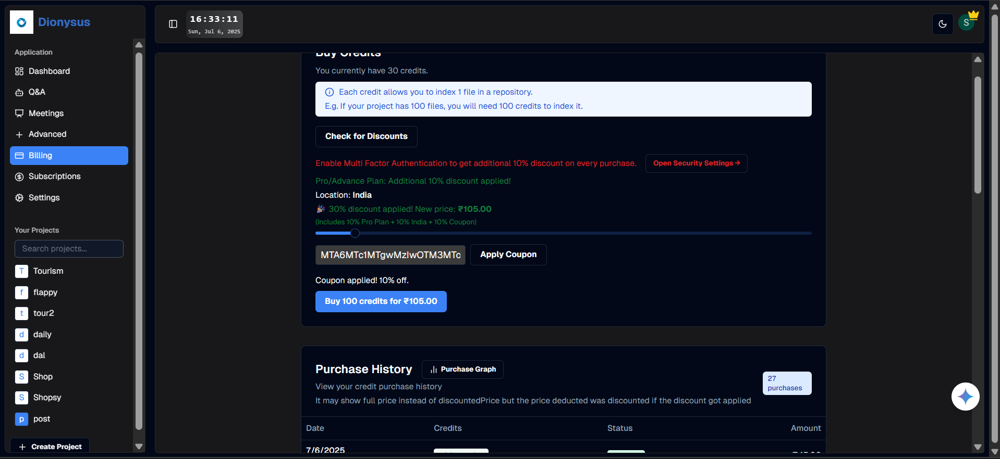
  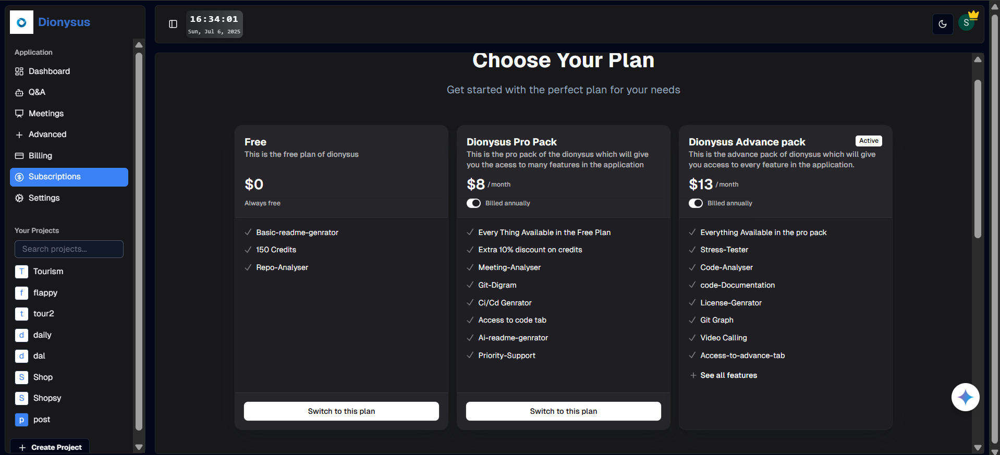
  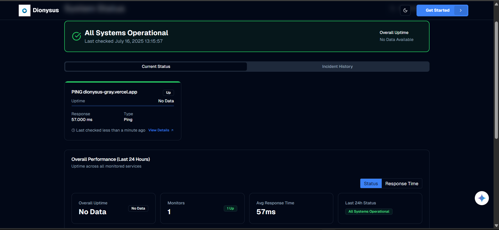
  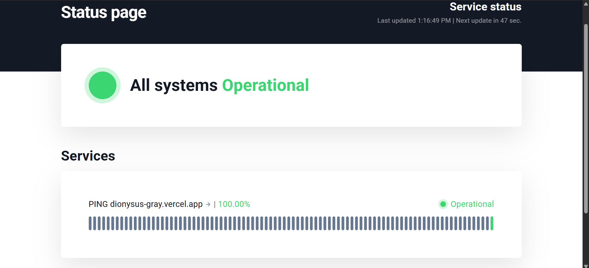
  
  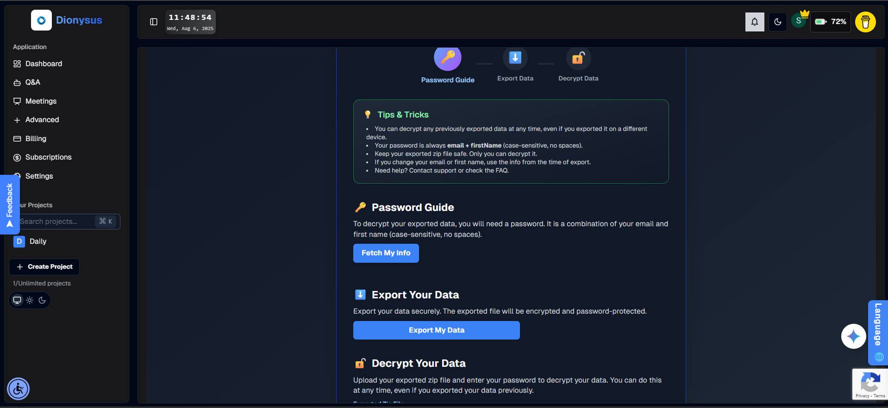
  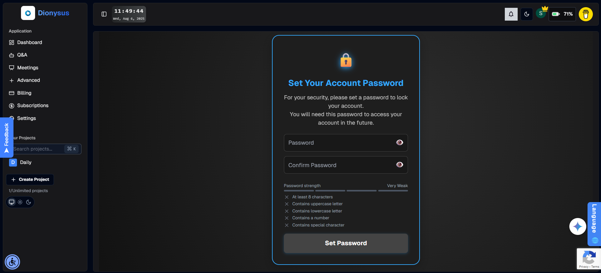
  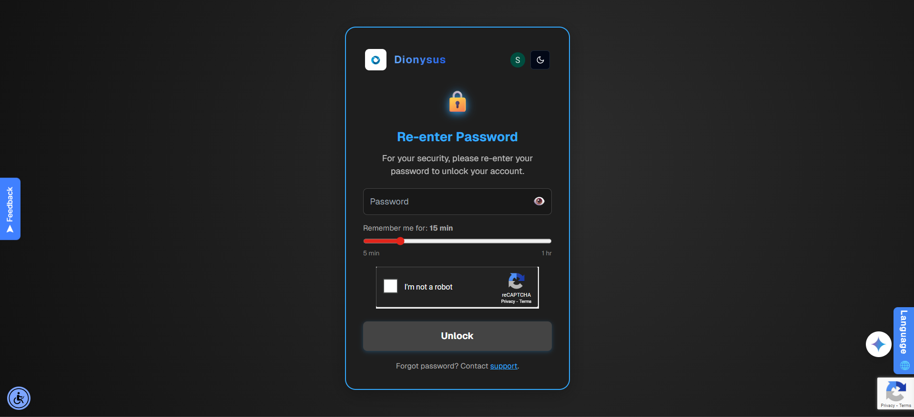
  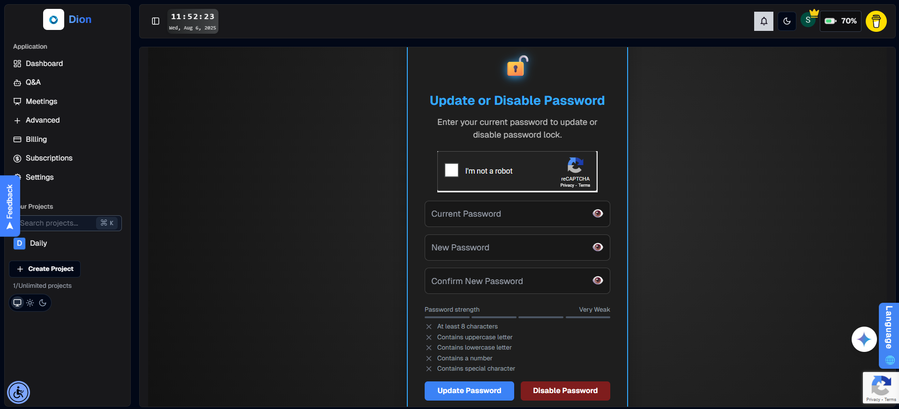
  
  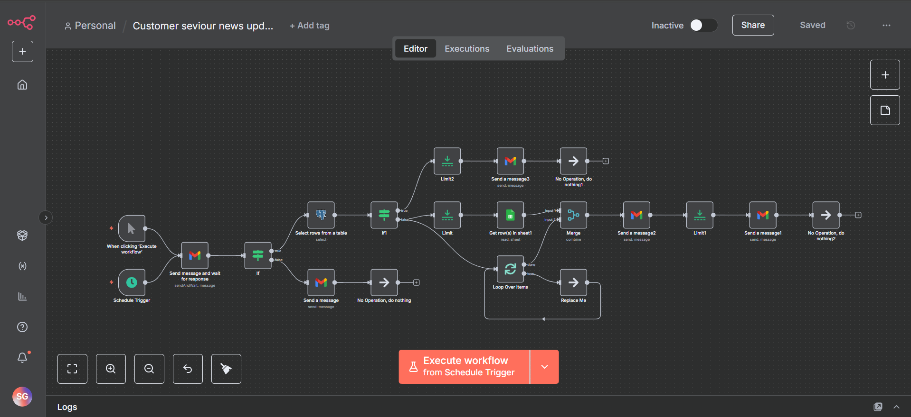

  <p style="font-size: 0.95em; color: #888;">
    <em>
      The images above demonstrates Dionysus's seamless integration with <strong>n8n</strong>, a powerful workflow automation tool. By leveraging n8n, Dionysus enables engineering teams to automate complex newsletter and important information delivery pipelines, streamline user onboarding communications, and orchestrate a wide range of workflow automations without manual intervention. This integration empowers organizations to set up automated triggers for sending newsletters and critical updates information based on user activity, segment audiences dynamically, and synchronize communications across multiple channels. As a result, teams benefit from increased productivity, reduced operational overhead, and more consistent, timely engagement with users and stakeholders. The n8n integration is fully configurable, allowing for custom workflows tailored to the unique needs of each enterprise, and is designed to scale with your organization's growth.
    </em>
  </p>
  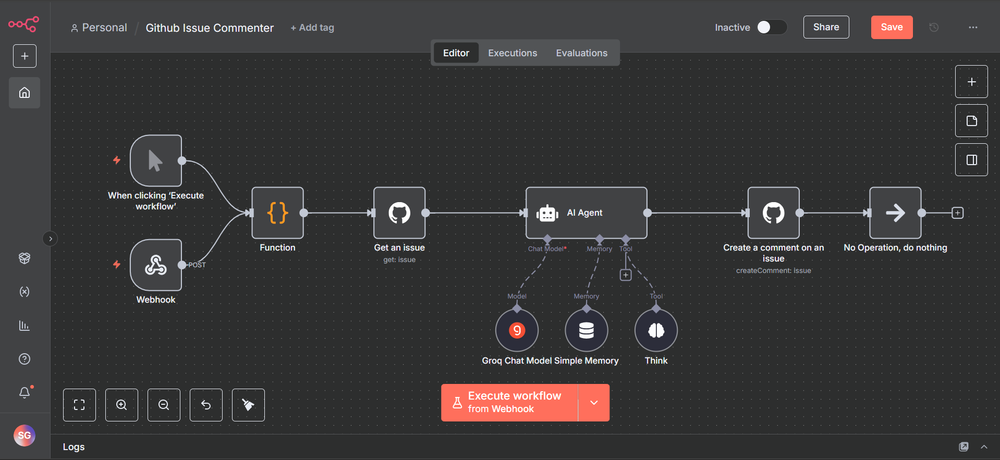
  <p style="font-size: 0.95em; color: #888;">
    <em>
    This image showcases the automation of commenting on all new GitHub issues using n8n, which automatically posts a comment whenever a new issue is created in the repository.
    </em>
  </p>
  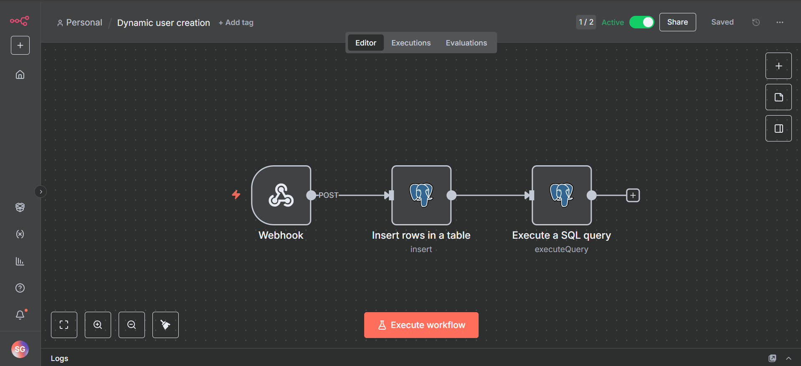
  <p style="font-size: 0.95em; color: #888;">
    <em>
    This image showcases the workflow which dynamically creates a new user in the system using n8n.
    Whenever a new user requests to get the self hosted version of n8n thats a feature with the advance users.
    </em>
  </p>
  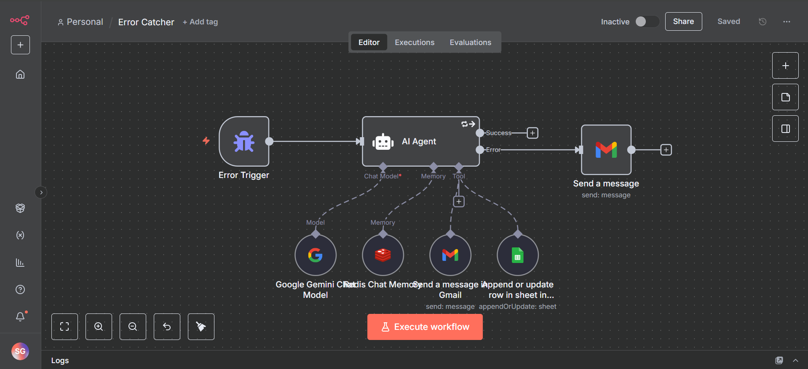
  <p style="font-size: 0.95em; color: #888;">
    <em>
    This image showcases the workflow which catches all the errors in any  workflow and process it using the ai to get to the root problem easily and mail me directly and also append a log in the Google Sheets for a later preview. This is an important workflow over all workflow which makes sure no workflow bugs out and cause any kind of problem.
    </em>
  </p>

---

## 🔐 Security & Compliance

Dionysus implements enterprise-grade security measures to protect sensitive data and ensure compliance with industry standards:

- **SOC 2 Compliant Infrastructure:** Built on security-certified cloud providers
- **GDPR-Ready Data Handling:** Complete data export and deletion capabilities
- **Access Control System:** Role-based permissions with principle of least privilege
- **Regular Security Audits:** Continuous vulnerability scanning and penetration testing
- **Data Encryption:** At-rest and in-transit encryption for all sensitive information
- **Audit Logs:** Comprehensive activity tracking for compliance and investigation
- **Secrets Management:** Secure handling of API keys and credentials
- **Two-Factor Authentication:** Additional security layer for account protection

---

## 🌐 Global Architecture

Dionysus leverages a distributed architecture for global availability and performance:

- **Multi-Region Deployment:** Optimized access from anywhere in the world
- **Edge Caching:** CDN integration for static assets and API responses
- **Serverless Functions:** Scale-to-zero capability for cost optimization
- **Database Replication:** Low-latency data access with regional replicas
- **Traffic Management:** Intelligent routing and load balancing
- **Rate Limiting:** Country-specific and user-based request throttling
- **DDoS Protection:** Advanced mitigation against distributed attacks
- **Scheduled Scaling:** Capacity adjustments based on usage patterns

---

## 🤝 Enterprise Contribution Process

Enterprise contributions follow a structured process to maintain quality and security:

1. **Issue Triage:** All changes start with a documented issue and security assessment
2. **Design Review:** Architecture proposals undergo peer review for quality and security
3. **Implementation:** Development follows strict coding standards with test coverage
4. **Code Review:** Multi-level review process with automated quality checks
5. **Security Scanning:** Automated vulnerability assessment before merge
6. **Staging Deployment:** Pre-production validation in isolated environment
7. **Canary Release:** Gradual production deployment with health monitoring
8. **Documentation:** Comprehensive updates to technical and user documentation

For detailed contribution guidelines, refer to the [CONTRIBUTING.md](CONTRIBUTING.md) and [CODE_OF_CONDUCT.md](CODE_OF_CONDUCT.md).

---

## 🆕 Recent Features & Improvements

- **Anonymized Error & Crash Reporting:** Users are now informed (via the CookieBanner) that anonymized error and crash data may be collected to improve reliability and security. No personal or sensitive data is ever included.
- **Robust Cookie Consent Banner:** The CookieBanner has been enhanced for clarity, accessibility, and transparency about privacy and data collection.
- **TypeScript & Linting Exclusions:** The `public/` and `.next/` directories are now excluded from both ESLint and TypeScript checks, preventing errors from vendor/minified files and build outputs.
- **Improved ErrorBoundary:** The error boundary UI is now more robust, scrollable, and user-friendly, with better error display and stack trace toggling.
- **About Page Expansion:** The `/about` page is now a visually rich, multi-section experience with testimonials, team, partners, fun facts, roadmap, press, gallery, awards, open source, video demo, changelog, and more, including external images.
- **CSP & Monitoring:** Content Security Policy (CSP) has been updated to support Sentry and Vercel Speed Insights, ensuring analytics and monitoring work without blocking scripts.
- **API Route Hardening:** Improved error handling and logging for `/api/recaptcha-verify` and `/api/set-password` routes, with better feedback in the UI.
- **RecaptchaGate Improvements:** The RecaptchaGate component now handles API errors gracefully, with fallback and bypass logic for a smoother user experience.
- **ESLint Config Fixes:** Config files (`postcss.config.js`, `prettier.config.js`) now export via variables to avoid ESLint warnings. The `.eslintignore` file ensures public assets are not linted.
- **Autoprefixer Dependency:** The missing `autoprefixer` package is now installed, resolving build errors for PostCSS.
- **Comprehensive System Visualizations:** Added full project architecture, process, and database diagrams on Eraser for onboarding, documentation, and technical clarity.
- **Eraser Integration:** All diagrams are now available and viewable in [Eraser](https://app.eraser.io/workspace/KuPhKKF9Cnq19Jr0BMBd), enabling collaborative architecture and process design.

---

## Interactive Tutorial & Learning Resources

Get started with Dionysus through our comprehensive interactive tutorials that walks you through every feature:

<p align="center">
  <a href="https://code2tutorial.com/tutorial/7e45f8f8-0f40-48c8-a078-c836316bed71/index.md">
    
  </a>
  <a href="https://code2tutorial.com/tutorial/12b11fd9-4eea-4309-be70-30fcc8bdc18f/index.md">
    
  </a>
  <a href="https://code2tutorial.com/tutorial/7a01553b-3ab7-44b3-a37e-a07d3b815f08/index.md">
    
  </a>
</p>

**What you'll learn:**

- 🚀 **Complete Setup Guide:** Step-by-step installation and configuration
- 🔧 **Feature Deep Dives:** Hands-on exploration of AI-powered code analysis
- 👥 **Team Collaboration:** Best practices for repository management and team workflows
- 🤖 **AI Integration:** Leveraging Gemini Pro for intelligent code insights
- 📊 **Analytics & Reporting:** Understanding your development metrics and KPIs
- 🔐 **Admin Features:** User management, security, and enterprise configurations

This interactive tutorial provides real-world examples, code snippets, and practical exercises to help you master Dionysus quickly and efficiently.

---

## 📊 Project Visualizations & Eraser Integration

All system, process, and database diagrams are available in Eraser and can be viewed in [Eraser](https://app.eraser.io/workspace/KuPhKKF9Cnq19Jr0BMBd). This enables real-time architecture and process design with your team.

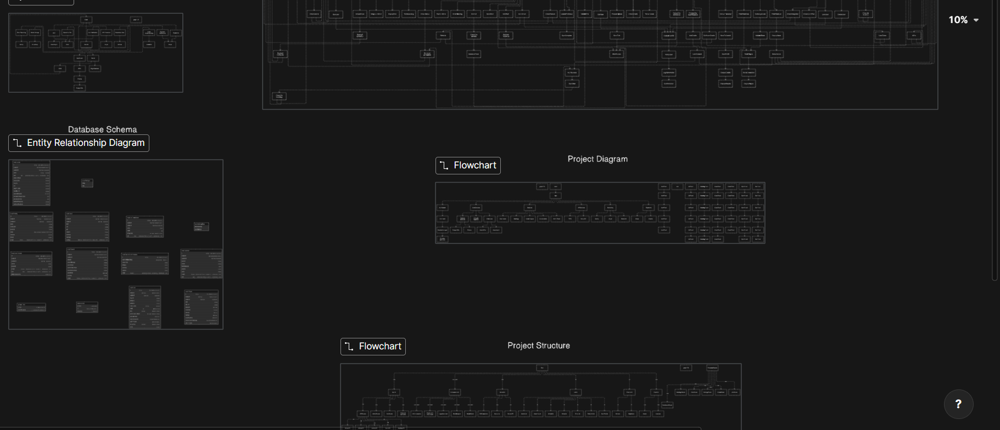

---

## Git Repository Visualization

Explore the full structure and relationships of the Dionysus repository with an interactive Git diagram:

<p align="center">
  <a href="https://gitdiagram.com/Saksham-Goel1107/Dionysus">
    
  </a>
</p>

**What is this?**

The [GitDiagram](https://gitdiagram.com/Saksham-Goel1107/Dionysus) provides a live, visual map of the entire Dionysus codebase. It helps you:

- **Understand repository structure** at a glance
- **Navigate code relationships** and dependencies visually
- **Onboard faster** with a bird's-eye view of all folders, files, and their connections
- **Collaborate and review** with clarity on project architecture

This is especially useful for new contributors, reviewers, and anyone interested in the technical architecture of Dionysus. Click the badge above to explore the interactive diagram!

---

## 📄 Licensing

This project is licensed under the [Dionysus Proprietary License](LICENSE). The source code is made available for review but all rights are reserved. Unauthorized reproduction, modification, or distribution is strictly prohibited. For licensing inquiries, please contact the repository owner.

## 🔑 Environment Configuration

<details>
<summary><strong>Access to <code>.env.example</code></strong></summary>

The <code>.env.example</code> file is encrypted with a password known only to the repository owner. If you require access for legitimate reasons (e.g., for development, testing, or contribution), please contact me directly with your request and a brief explanation of your intended use. Requests without a valid reason will not be considered.

</details>

<div align="center">
Copyright © 2025 Dionysus. All Rights Reserved.
</div>
